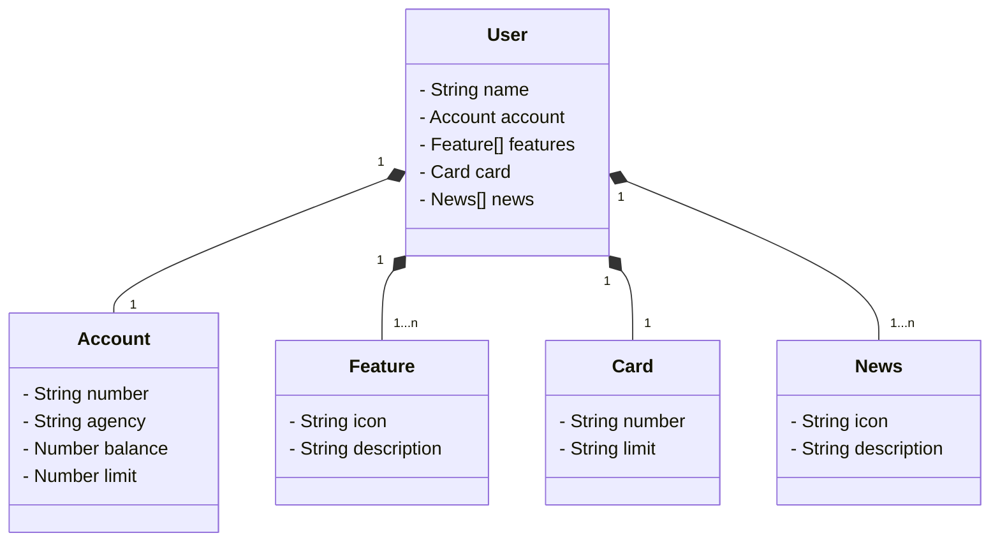

Projeto Final para o Bootcamp Claro 2024 da plataforma Digital Innovation One.

##Diagrama de Classe:

```mermaid 

    classDiagram
    class User {
        - String name
        - Account account
        - Feature[] features
        - Card card
        - News[] news
    }

    class Account {
        - String number
        - String agency
        - Number balance
        - Number limit
    }

    class Feature {
        - String icon
        - String description
    }

    class Card {
        - String number
        - String limit
    }

    class News {
        - String icon
        - String description
    }

    User "1"*--"1" Account
    User "1"*--"1...n" Feature
    User "1"*-- "1"Card
    User "1"*-- "1...n" News
```
